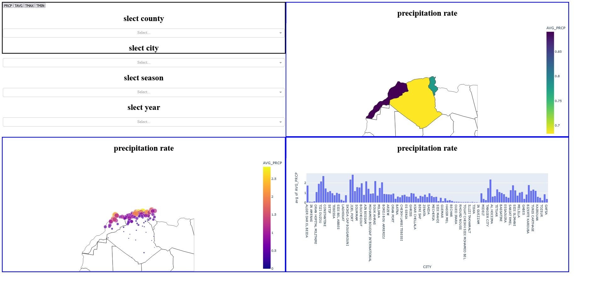

# North Africa Weather Data Warehouse

> Data Warehouse & Dashboard for weather data in Algeria, Morocco, and Tunisia (1920 – 2022)



## Project Description

This **Data Warehouse** project builds a climate data warehouse from raw CSV files (NOAA / GHCN source), then analyzes and visualizes the data through an interactive dashboard.

It covers a full BI cycle:

1. **Extract** — merge files from `Weather Data/` (Algeria, Morocco, Tunisia)
2. **Transform** — clean data, build station and date dimensions, handle missing values
3. **Load** — load data into a MySQL database using a Star Schema
4. **OLAP Cube** — generate the multidimensional cube `cube_data.csv` (station x year x season)
5. **Visualisation** — Dash + Plotly dashboard (Africa maps + charts)

## Project Structure

```text
datawarehows_project/
├── main_etl.py                  # Full ETL script + warehouse and cube creation
├── main_dash.py                 # Interactive dashboard (Dash)
├── cube_data.csv                # Final cube (ETL output, dashboard input)
├── dash.exe                     # Frozen dashboard build (direct run on Windows)
├── Weather Data/                # Raw data
│   ├── Algeria/  (1920-2022, ~11 files)
│   ├── Morocco/  (1920-2022, ~4 files)
│   └── Tunisia/  (1920-2022, ~4 files)
├── Staging_Area/                # Staging area
│   ├── all_data.csv             # Merged files (generated at runtime)
│   ├── station.csv              # Cleaned station dimension (generated at runtime)
│   ├── weather.csv              # Cleaned fact table (generated at runtime)
│   └── Dim_Date_1850-2050.csv   # Ready-made date dimension (Year, Season, Quarter, ...)
├── rapport entrepôt de données .docx / .pdf  # Academic project report
└── README.md
```

## Warehouse Model (Star Schema)

Database: `Weather_DataWarehouse` (MySQL)

| Table | Type | Description |
|---|---|---|
| `station_dim` | Dimension | `STATION_ID` (PK), `CITY`, `COUNTRY`, `COUNTRY_ISO` (DZA/MAR/TUN), `LATITUDE`, `LONGITUDE`, `ELEVATION` |
| `date_dim` | Dimension | `Date_ID` (PK, YYYYMMDD format), `Date`, `Year`, `Season`, `Quarter`, `Month_*`, `Day_*`, holidays |
| `weather_fact` | Fact | `STATION_ID` + `Date_ID` (composite PK), `PRCP`, `TAVG`, `TMAX`, `TMIN`, `SNWD`, `SNOW`, `WDFG`, `WSFG`, `WT01`…`WT18` |

Relationships:

```text
station_dim (1) ──< (N) weather_fact (N) >── (1) date_dim
```

## ETL Steps (`main_etl.py`)

| Function | Role |
|---|---|
| `etl_extract()` | Read all `*.csv` files from `Weather Data/` and merge them into `Staging_Area/all_data.csv` |
| `etl_transformation_station()` | Deduplicate stations, extract `CITY` from `NAME`, map country codes (`AG→Algeria/DZA`, `MO/SP→Morocco/MAR`, `TS→Tunisia/TUN`), save `station.csv` |
| `etl_transformation_weather()` | Fill empty `PRCP` with `0`, `TMAX`/`TMIN` with mean, `TAVG` from `(TMAX+TMIN)/2`, generate `Date_ID`, round to one decimal, save `weather.csv` |
| `create_datawarehows()` | `DROP + CREATE DATABASE`, create the three tables + foreign keys |
| `etl_load()` | Load `station.csv`, `Dim_Date_1850-2050.csv`, and `weather.csv` row by row into MySQL |
| `create_multidimensional_cube()` | Query `AVG(PRCP/TAVG/TMAX/TMIN)` grouped by `STATION_ID, Year, Season` and save to `cube_data.csv` |

Cube query example:

```sql
SELECT station_dim.*, date_dim.Year, date_dim.Season,
  ROUND(AVG(weather_fact.PRCP),2) AS AVG_PRCP,
  ROUND(AVG(weather_fact.TAVG),2) AS AVG_TAVG,
  ROUND(AVG(weather_fact.TMAX),2) AS AVG_TMAX,
  ROUND(AVG(weather_fact.TMIN),2) AS AVG_TMIN
FROM weather_fact, station_dim, date_dim
WHERE weather_fact.STATION_ID = station_dim.STATION_ID
  AND weather_fact.Date_ID = date_dim.Date_ID
GROUP BY weather_fact.STATION_ID, date_dim.Year, date_dim.Season;
```

`cube_data.csv` columns:

```text
STATION_ID, CITY, COUNTRY, COUNTRY_ISO, CODEN, LATITUDE, LONGITUDE, ELEVATION,
Year, Season, AVG_PRCP, AVG_TAVG, AVG_TMAX, AVG_TMIN
```

## Dashboard (`main_dash.py`)


- **Metrics:** `PRCP` (precipitation) / `TAVG` (average temperature) / `TMAX` / `TMIN` buttons
- **Filters:** Country (`DZA`, `MAR`, `TUN`), City, Season (`Spring/Summer/Fall/Winter`), Year
- **Charts:**
  1. Africa Choropleth map (average by country)
  2. Station `scatter_geo` map (by station, size = metric value)
  3. City `histogram` bar chart

## Requirements

- Python 3.9+
- MySQL Server (local, user `root` with no password — editable at the top of `main_etl.py`)
- Libraries:

```bash
pip install pandas pymysql dash plotly
```

> Connection settings in `main_etl.py`:
> `host=localhost / user=root / password='' / database=Weather_DataWarehouse`

## Usage

### 1. Run the ETL (build warehouse + cube)

```bash
python main_etl.py
```

Execution order: `etl_extract` -> `etl_transformation_station` -> `etl_transformation_weather` -> `create_datawarehows` -> `etl_load` -> `create_multidimensional_cube`.

### 2. Run the dashboard

```bash
python main_dash.py
```

Then open your browser at: `http://127.0.0.1:8050`

### 3. Quick run (without Python)

```bash
dash.exe
```

> Note: the dashboard reads the existing `cube_data.csv`, so it can run directly without re-running the ETL.

## Notes

- `Weather Data/` is large (tens of MB per country) — `etl_load` inserts row by row and may take a long time.
- File encoding: `utf-8-sig` with `,` delimiter.
- Full project report in `rapport entrepôt de données.docx.pdf`.

## Author

Academic Data Warehousing / BI project — North Africa climate data.
